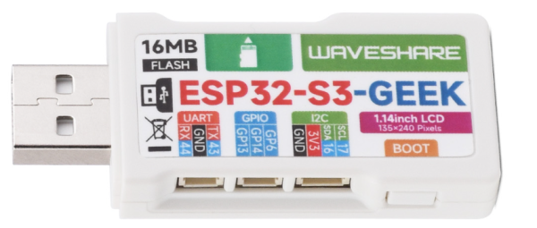

# GpsRecorder

Projet basé sur une clé USB [ESP32-S3-GEEK](https://www.waveshare.com/wiki/ESP32-S3-GEEK) de la Société [Waveshare](https://github.com/waveshareteam) 

# Présentation du projet
Le but de ce projet commencé en mars 2020 est la réalisation d'une boussole à guidage vocal à l'image d'un GPS de voiture permettant d'assister vocalement le randonneur dans ses déplacements.

Cette boussole fournit les informations et fonctionnalités suivantes; à savoir :
 - La date complète (année, mois, jour), le jour de la semaine et l'heure locale avec le support automatique du changement d'heure été/hiver
 - L'enregistrement de plusieurs positions autour ou sur le tracé à suivre et la mémorisation sur demande des positions des lieux où l'on se trouve 
 - Informer l'utilisateur de sa position actuelle à des intervalles de temps prédéfinis suivant la position par rapport au tracé à suivre 
 - Fournir à l'utilisateur un lien vers une destination en ligne pertinente (distance et cap de la rose des vents ou cap horaire suivant la vitesse instantanée)

🔔 A noter que le cap est pertinent dans les trames GPS si la vitesse de déplacement n'est pas nulle auquel cas le cap horaire par rapport au déplacement est synthétisé parmi 12 orientations horaires relatives (ie. Quatorze heures), sinon c'est le cap absolu de la rose des vents qui est synthétisé parmi 16 orientations absolues (ie. Sud-Sud-Est).

 - La direction à prendre pour suivre un itinéraire donné (distance et cap sur ou par rapport au tracé, distance avant une bifurcation, distance et cap à suivre après une bifurcation, etc.) ou pour rejoindre à vol d'oiseau une position donnée et qui sera issue d'une trace GPS préalablement enregistrée ou mémorisée
 - L'heure et le temps estimés pour rejoindre la position d'arrivée et ce, en fonction de l'allure et le profil du terrain constatés au cours de la randonnée
 - La synthèse de la distance à vol d'oiseau et le cap à la ville ou à la commune la plus proche de la position courante parmi plus de 450 villes et communes de la France métropolitaine
 - Les consignes vocales par rapport au tracé à suivre sont déterminées en temps réel sans préchargement préalable et ce quelle que soit la position géographique où l'on se situe. En particulier, aucune connexion Internet n'est nécessaire pour synthétiser ces consignes
 - Enregistrement du tracé suivi, construction et inversion de celui-ci sur demande afin d'être assisté pour le suivre en sens inverse et rejoindre ainsi son point de départ

Toutes les informations sont présentées sous une forme vocale car par expérience, l'utilisation des GPS pour randonneurs avec écran, comme d'ailleurs les smartphones, souffrent d'inconvénients majeurs qui sont en autres :
 - L'absence de lisibilité partielle ou totale dans le cas de grand soleil ou de contre-jour
 - La nécessité de le regarder empêchant au mieux d'admirer le paysage et au pire de trébucher
 - L'obligation de "zoomer" et "dézoomer" fréquemment pour déterminer l'endroit précis sur la carte suivant la taille de l'écran et les détails du fond de carte présentés
 - L'autonomie limitée entre 12 et 20 heures pour les GPS de randonnée. A noter que cela peut être bien meilleur pour les smartphones pour peu de l'utiliser astucieusement (cf. Quel smartphone de randonnée choisir ?)
 - La fragilité des smartphones en cas de chute à cause de leur grand écran. Cela est moins vrai pour les GPS de randonnée qui sont mieux protégés et ont surtout un écran plus petit

La seule interface d'entrée est un bouton poussoir rotatif du type KY-40 permettant d'accéder à divers menus comme la mémorisation de la position courante, l'inversion du tracé à suivre, les statistiques cinématiques de la randonnée (vitesses moyenne et maximale depuis le départ, l'heure estimée d'arrivée, la connaissance des dénivelés cumulés en positif et négatif, le réglage du volume sonore, etc.
Les caractéristiques de cette boussole sont :
 - Dimensions L x l x h : 170mm x 110mm x 55mm (hors bouton poussoir rotatif)
 - Poids: 600g (dont 300g pour le bloc alimentation de 10400 mAh sous 5 Volts)
 - Autonomie : environ 50 heures
 - Plage de température : entre 5° et 40° Celsius (utilisation dans un sac à dos été comme hiver)
 - Pas d'orientation imposé dans le transport (absence de magnétomètre et d'accéléromètre)
 - Support d'oreillettes Bluetooth
 - Réglage du volume sonore via le bouton poussoir rotatif et/ou les oreillettes si supporté
 - Étanche aux projections d'eau (coffret plastique verrouillé par fermetures)
 - Arrêt / Marche, Rechargement de la batterie et RESET matériel sans ouverture du coffret
 - Symbologies de fonctionnement par Leds (watchdog, heartbeat, acquisition / perte des signaux GPS, diffusion d'un message vocal en cours, état connecté / déconnecté d'appariement des oreillettes Bluetooth, codes et comptabilisations des erreurs, etc.)

🔔 La partie GPS (enregistreur de traces et parcours de référence sur clé USB) est le bloc fonctionnel du projet Enregistreur de traces GPS raccordé à un nouveau bloc à base d'un ESP32 qui réalise tous les traitements et le pilotage d'un lecteur MP3 série relié à un transmetteur Bluetooth permettant une restitution vocale au moyen d'oreillettes sans fil.
